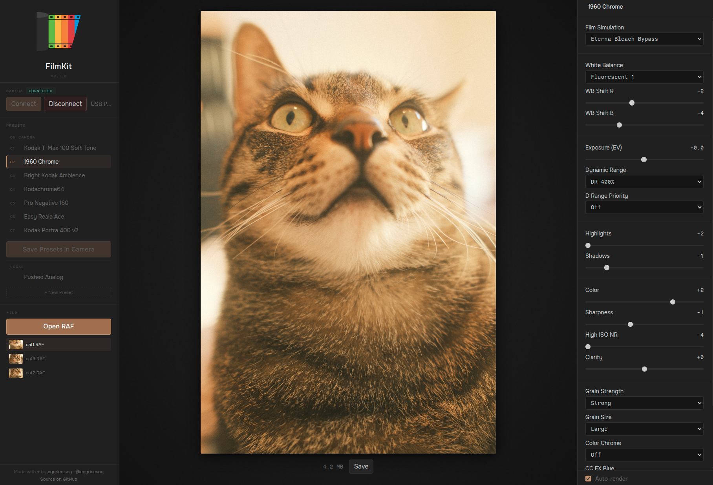

<p align="center">
  
  <br><br>
  <strong><a href="https://filmkit.eggrice.soy">filmkit.eggrice.soy</a></strong>
</p>

# FilmKit

Browser-based preset manager and RAW converter for Fujifilm X-series cameras.

> Note that the app is in **BETA**. It's currently tested on **X100VI** only. It likely works with other X-series cameras that support Fujifilm's RAW conversion protocol (X-T5, X-H2, X-T30, etc.), but this has not been verified. If you have a different camera and want to help, see [Supporting New Cameras](#supporting-new-cameras) below.



_This is author's cat. Shoutout to [Fuji X Weekly](https://fujixweekly.com/) for awesome presets!_

## Features

Just like [Fujifilm X RAW STUDIO](https://www.fujifilm-x.com/global/products/software/x-raw-studio/), FilmKit uses WebUSB to connect directly to your camera, your camera's own image processor handles the conversion.

- **Camera Preset Management** - Read, edit and write custom presets on your camera. The iteration should be significantly faster than X RAW STUDIO, thanks to better camera work queue management, non-locking UI and auto-conversion toggle.
- **Local Preset Library** - Save presets in your computer, drag & drop between camera and local storage.
- **RAW Conversion and Live Preview** - Select a RAF file, adjust film simulation parameters, and get back a full-quality JPEG processed by the camera.
- **Preset Detection** - Loading a RAF file automatically detects which preset was used to shoot it (temporary profile created if not present).
- **Preset import/export** - Import or export presets as file, link or text paste.
- **Quick compare** - QUickly compare between original and current preset.
- Zero installation and cross-platform (supports Linux).

## Requirements

**Chromium-based browser** like Google Chrome: WebUSB is Chromium-only on desktop.

Appropriate udev rule required if Chromium is running in Flatpak, ex:

```
SUBSYSTEM=="usb", ATTR{idVendor}=="04cb", MODE="0666"
```

## How It Works

FilmKit communicates **PTP (Picture Transfer Protocol)** over USB, the same protocol that X RAW STUDIO uses. The camera does all the heavy lifting: it receives the RAF file and conversion parameters, processes them, and returns a JPEG.

For preset management, FilmKit reads and writes individual preset properties (D18E–D1A5) using standard PTP `GetDevicePropValue` / `SetDevicePropValue` operations.

See [QUICK_REFERENCE.md](QUICK_REFERENCE.md) for full protocol documentation.

## Reverse Engineering

FilmKit's protocol implementation was built with the following reference materials:

- **[rawji](https://github.com/pinpox/rawji)**
- **[fudge](https://github.com/petabyt/fudge)**
- **[libgphoto2](http://www.gphoto.org/)**
- **Wireshark USB captures**: communication between X100VI and X RAW Studio were captured using Wireshark (on Windows with USB capture) to reverse-engineer preset property encoding, write ordering, and conditional write behavior (ex. HighIsoNR uses a proprietary non-linear encoding, Color Temperature can only be written when WB mode is set to Color Temp, monochrome film simulations reject Color writes).

The camera's native d185 profile format (625 bytes) uses different field indices and encoding from the format in RAF files. FilmKit uses a patch-based approach: copy the base profile byte-for-byte, only overwrite fields the user changed, to preserve EXIF sentinel values.

## Supporting New Cameras

FilmKit has only been tested on the **X100VI**. If you have a different Fuji X-series camera and want to help expand support, you can capture USB traffic with Wireshark:

### How to capture

1. Install [Wireshark](https://www.wireshark.org/) with USBPcap (or equivalent for macOS)
2. Open Wireshark and start capturing on the USB bus your camera is connected to (ex. `USBPcap1:\\.\USBPcap1`)
3. Open Fujifilm X RAW Studio, and perform one of the following actions you want to capture:
   - **Profile read**: Just connect and let the app read the camera state
   - **Preset save**: Change all preset values and save it to one of the profile slots
   - **RAW conversion**: Load a RAF and convert with one of the presets (local or on-camera)
4. Stop the capture and save as `.pcapng`
5. Repeat from 3 for another action.

Filter Wireshark with `usb.transfer_type == 0x02` (bulk transfers) to see only PTP traffic.

### What to share

Open an issue on GitHub with:
- Your camera model and firmware version
- What you captured (please capture all three)
- The `.pcapng` files
- The parameter values you used (so we can correlate bytes to settings)

Additional captures may be required with various property values (ex. for ranged-based value, typically preset save or profile read of min/max values are good enough, but we may face another case of HighIsoNR weirdness).

## Contributing

This project does **not** accept any pull requests.

**What is welcome:**
- Bug reports via [Issues](https://github.com/eggricesoy/filmkit/issues)
- Feature requests via [Issues](https://github.com/eggricesoy/filmkit/issues)
- Camera compatibility reports with Wireshark captures (see [Supporting New Cameras](#supporting-new-cameras))

### Bug Reports

When filing a bug report, please include:
1. Your camera model and firmware version
2. Steps to reproduce the issue
3. The **debug log** - scroll down to the Debug section at the bottom of the right sidebar, click **Copy Log**, and paste it into the issue

---

Made with &#9829; by [eggricesoy](https://eggrice.soy) · [@eggricesoy](https://x.com/eggricesoy)
